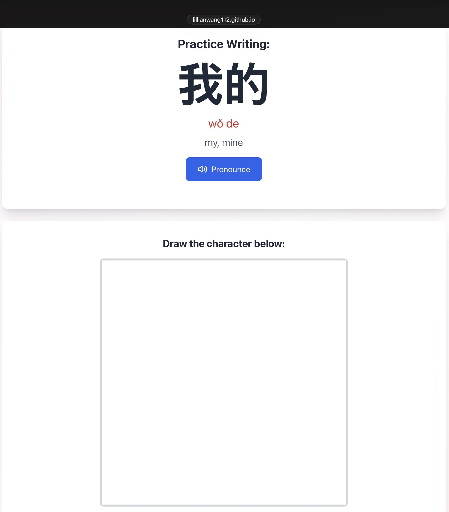

# Chinese Learning App - CHI 108

大家好! 👋

I built this app to help with learning the vocabulary for CHI 108. It's a full-featured Chinese learning tool with flashcards, handwriting practice, games, and more! 

## ⚡️ Quick Start (TL;DR)
1. Visit the app → Click "Import Deck"
2. Download JSON files from the [108vocab folder](https://github.com/lillianwang112/chinese-learning-app/tree/main/108vocab)
3. Import them into the app
4. Start with **Study Mode** to learn new words
5. Use **Learn Mode** to test yourself
6. Use **Writing** to practice handwriting characters

## 📱 What Can This App Do?

- **Flashcard Mode**: Smart spaced repetition (cards you struggle with come back sooner!)
- **Learn Mode**: Quiz yourself actively with multiple choice, fill-in-blank, or written answer questions
- **Writing Practice**: Draw characters with your mouse/stylus/finger
- **Match Game**: Fun timed matching exercise
- **Test Mode**: Quiz yourself with multiple choice
- **Progress Tracking**: See your stats and which cards need review

The app uses the **SM-2 spaced repetition algorithm** - the same one used by Quizlet, Anki and other popular flashcard apps!

## 🚀 How to Use

### Step 1: Open the App
Visit: **[https://lillianwang112.github.io/chinese-learning-app/](https://lillianwang112.github.io/chinese-learning-app/)**

### Step 2: Download Vocabulary Files
All the CHI108 vocabulary JSON files are in the [108vocab folder](https://github.com/lillianwang112/chinese-learning-app/tree/main/108vocab) of this GitHub repository. The CHI103 mega vocabulary files are in the [103vocab folder](https://github.com/lillianwang112/chinese-learning-app/tree/main/103vocab).

**To download**:
1. Go to the vocabulary folder
2. Click on a JSON file you want (e.g., `高考.json`)
3. Click the **"Download"** button (or right-click "Raw" → "Save link as...")
4. Save it to your computer

**Pro tip**: Download all the files you need at once! Right-click each → "Save link as..."

### Step 3: Import into the App
1. In the app, click **"Import Deck"**
2. Select the JSON file you downloaded
3. The vocabulary will be added to your deck!
4. Repeat for any other topics you want to study

### Step 4: Start Learning! 🎉
- Click **"Study"** to review with flashcards
- Click **"Practice Writing"** to draw characters
- Use **"Match Game"** or **"Test"** for quick reviews

## 💡 Study Tips

1. **Import multiple decks** - Add all the topics we're covering this semester
2. **Use writing practice** - Actually drawing characters helps with retention way more than just recognition
3. **Try different modes** - Mix up flashcards, writing, matching, and tests to keep it interesting

## 📚 Available Vocabulary Decks

We have **24 vocabulary decks** covering everything from CHI 108, listed below in the order it appears on the semester schedule!
Note that these currently contain ALL of vocabulary from the 课本, not just the ones listed on the study guide. (If you wish to 
delete the extra ones, you may do so by editing the deck.) 

### Week 1-2: Privacy & Social Etiquette
- **Privacy.json** (43 cards) - Lesson 11: 隐私, 私事, 权利
- **走后门.json** (35 cards) - Lesson 12: Using connections, 社会关系
- **到时候再说吧.json** (44 cards) - ANC Lesson 18: Politeness, 面子, social responses
- **饭桌上的客套.json** (48 cards) - Oh China Lesson 18: 饭桌, 客套, 招待, 礼节

### Week 3-4: Beijing Life
- **北京的早晨.json** (41 cards) - Lesson 14: Morning routines, 锻炼, 打太极拳
- **北京的夜市.json** (32 cards) - ANC Lesson 15: 夜市, 后海, 酒吧, street food
- **北京的交通.json** (29 cards) - Lesson 16: 王府井, 交通工具, 污染
- **麦当劳.json** (25 cards) - Lesson 20: Fast food, 汉堡包, 效率

### Week 5-6: Patriotism & Economy (Before Midterm)
- **体育和爱国.json** (33 cards) - Lesson 22: Sports, patriotism, 女排
- **中国制造.json** (31 cards) - ANC Lesson 24: Manufacturing, 工厂, 质量
- **铁饭碗打破了.json** (23 cards) - ANC Lesson 27: Job security, 分配, 竞争

### Week 7-8: Education System
- **高考.json** (36 cards) - ANC Lesson 29: College entrance exam, 教育, 公平
- **开放留学政策.json** (28 cards) - ANC Lesson 38: Study abroad, 出国, brain drain
- **家里的小皇帝.json** (42 cards) - Lesson 27: One-child policy, 独生子女, 压力
- **读书和考试.json** (41 cards) - Lesson 28: Education values, career paths

### Week 9-10: Social Change & Chinese Americans
- **现在好还是从前好.json** (27 cards) - Lesson 33: Social change, 变化, 开放 vs 封闭
- **双语教育.json** (31 cards) - Oh China Lesson 22: Bilingual education, 少数民族
- **美国的华侨.json** (48 cards) - Oh China Lesson 19: Chinese Americans, immigration
- **华裔需要不需要政治代表.json** (47 cards) - Oh China Lesson 20: Political representation

### Week 11-12: Women's Rights & Daily Life (Final Topics)
- **中国的妇女.json** (48 cards) - Lesson 25: Women in China, 缠足, modern equality
- **离婚.json** (52 cards) - Lesson 26: Divorce, marriage, 传统
- **人权和贸易.json** (27 cards) - Oh China Lesson 23: Human rights, reform, 改革
- **中国人的衣食住行.json** (56 cards) - Oh China Lesson 31: Basic necessities: food, clothing, housing, transportation

### CHI 103 Review
- **CHI103-CHAR List.json** (522 characters) - Complete character review from CHI 103

**Total: Over 900 vocabulary words!** 🎉

All CHI 108 vocabulary files are in the [108vocab folder](https://github.com/lillianwang112/chinese-learning-app/tree/main/108vocab).
The CHI 103 character list is in the [103vocab folder](https://github.com/lillianwang112/chinese-learning-app/tree/main/103vocab).

## ✨ App Features

### 📖 Study Mode (Flashcards)
- Click the card to flip between Chinese character and detailed English definitions
- Audio pronunciation button lets you hear the word
- Shows pinyin with tone marks and comprehensive word meanings
- After flipping, choose:
  - **"I Know This" (swipe right/green button)** - Card moves further back in review queue
  - **"Still Learning" (swipe left/red button)** - Card comes back sooner
- **Pro tip**: Press "g" for grammar notes on certain words
- Smart spaced repetition tracks which cards need more practice

### ✍️ Writing Practice
- **Two modes**: Practice 10 cards or all cards at once
- Draw characters with your mouse/stylus/finger on the canvas
- Scroll back up when you're done drawing to see if you got it right
- Rate yourself honestly:
  - **"I Know This"** - You wrote it correctly → Card moves to the back of the queue
  - **"I Forgot"** - You got it wrong or needed to peek → Card comes back sooner for more practice
- Clear button to erase and try again
- Audio pronunciation button available
- Keep practicing! Cards you struggle with will reappear until you master them

- **Pro tip**: Scroll slightly down to cover up the character(s) to exercise your memory (recommended)

  
  
  

  <em>Left: Character visible | Middle: Scroll to hide character | Right: Compare your answer</em>

### 🧠 Learn Mode (Active Quizzing)
- **Two question types** that alternate:
  - **Multiple Choice**: See the Chinese character, select correct English meaning from 4 options
  - **Fill in the Blank**: See the character, type the pinyin pronunciation
- **Tip for typing pinyin**: You can type with tone numbers (ni3 ha3o) OR with tone marks (nǐ hǎo) - both work!
- Instant feedback shows if you're correct or need more practice
- Shows correct answer with pinyin and meaning after each question
- Progress bar tracks your completion (e.g., "2 of 15")
- **Adaptive difficulty**: Tracks how well you know each card (0/5 scale)

### 🎮 Match Game
- 16 tiles appear: 8 Chinese characters + 8 English meanings
- Click two tiles to match them
- Correct matches stay revealed and fade out
- Timer tracks how fast you complete all 8 pairs
- Great for quick vocabulary refreshers!

### 📝 Test Mode
- Multiple choice questions
- Immediate feedback
- Track your score

### 📊 Deck Management
- View all your cards
- Delete cards if you only want to study the ones listed on the study guide
- Add cards if there are some from the 课文 you aren't familiar with but are not in the list
- Clear deck if needed

## 📱 Works on Any Device
- **Desktop**: Use your mouse to draw characters
- **Tablet/Phone**: Use your stylus (recommended) or finger
- **Offline**: Works without internet after the page loads
- **All your progress is saved** in your browser automatically

## ❓ Questions?

**Q: Can I use this offline?**
A: Yes! Once the page loads, you can study without internet.

**Q: Does this work on my phone?**
A: Absolutely! Just open it in your mobile browser. Although it may be better to use on a tablet with 
a stylus for the handwriting practice. Rotating your phone horizontally and handwriting with your finger
also works.

**Q: Can I study multiple topics at once?**
A: Yes! Import as many vocabulary decks as you want at a time.

**Q: What are the buttons at the bottom of each deck?**
A: Blue pencil = Edit deck, Green = Export/Download, Red = Delete entire deck

**Q: Do I need to enter tone marks when typing pinyin?**
A: The app accepts both! Type "ni3 ha3o" or "nǐ hǎo" - it checks both.

**Q: Can I delete cards I already know?**
A: Yes! Click the edit (pencil) button on a deck, then delete individual cards you don't need.

**Q: How does the spaced repetition work?**
A: Cards you mark "I Know This" come back less frequently. Cards you mark "Still Learning" or get wrong in quizzes come back sooner for more practice.

## 🆚 How Does This Compare to Other Apps?

### vs. Skritter
**Skritter** ($15-20/month, ~$100/year)
- ✅ Advanced stroke order correction
- ✅ 10+ years of development
- ❌ Expensive subscription
- ❌ Requires paid account for full features

**This App** (FREE!)
- ✅ Completely free, no ads
- ✅ Handwriting practice with canvas
- ✅ 6 study modes in one place (Study, Learn, Match, Test, Write, Edit)
- ✅ Pre-loaded with CHI 108 course vocabulary
- ✅ Works in browser, no app download needed
- ⚠️ No stroke order correction (but you can check yourself!)

### vs. Quizlet
**Quizlet** (Free with ads, $8/month for Quizlet Plus)
- ✅ Huge library of shared decks
- ✅ Very popular, network effects
- ❌ Many features behind paywall (Learn mode, ad-free)
- ❌ Frequent ads on free tier
- ❌ No handwriting practice mode
- ❌ Not optimized for Chinese-specific needs

**This App** (FREE!)
- ✅ Completely free, no paywalls
- ✅ No ads ever
- ✅ Handwriting practice built-in
- ✅ Chinese-specific features (pinyin, audio, tone marks)
- ✅ Made specifically for CHI 108 students

### vs. Pleco
**Pleco** (Free dictionary, paid add-ons)
- ✅ Best Chinese dictionary app
- ✅ Excellent handwriting recognition for lookup
- ✅ OCR for reading text
- ⚠️ Primarily a dictionary, not a study/flashcard app

**This App** (FREE!)
- ✅ Purpose-built for studying and memorization
- ✅ Spaced repetition for efficient learning
- ✅ Multiple study modes

### 💡 Bottom Line
If you're already paying for Skritter or Quizlet Plus and love them, keep using them! But if you're looking for a **free, comprehensive, ad-free study tool specifically made for CHI 108**, this app has you covered. **No paywalls. No subscriptions. No ads. Just learning.** 🎯

## 🙏 About This Project

This was created by a CHI 108 student for a more tailored vocabulary learning app experience. 

**Note:** This app is still a work in progress and may have bugs. If you find any issues or have suggestions for improvements, please let me know at **lw3319@princeton.edu**. Your feedback helps make it better for everyone!

The app is open source and available for anyone to use. If you find it helpful, feel free to share it with other Chinese learners!

**Good luck everyone! 加油!** 💪📚

---

*Perfect for: Daily review • 写字比赛 prep • Character practice • Quick refreshers before class*

*Made by Lillian Wang - Princeton University - CHI 108 - Spring 2026*
