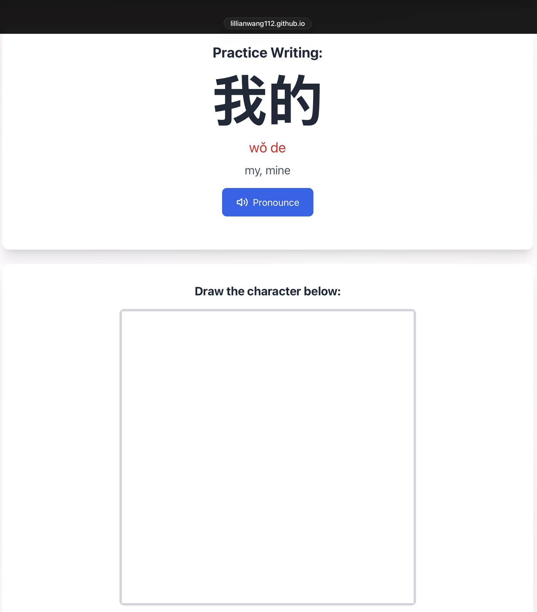
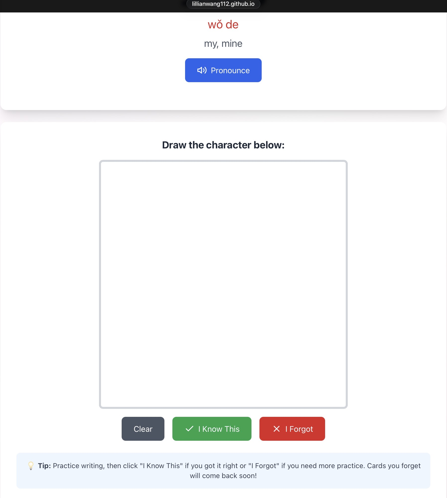
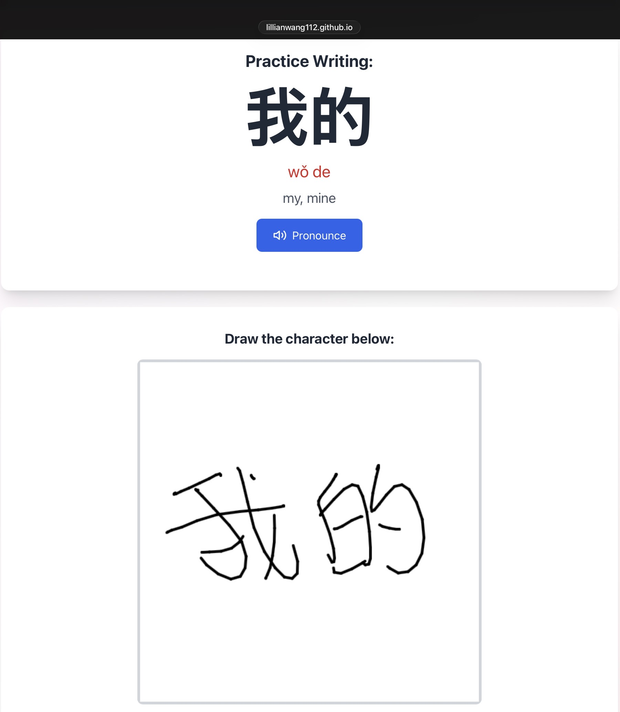

# 中文-Learn Chinese Learning App
### CHI 108 - Princeton University

<p align="center">
  
</p>

<p align="center">
  <strong>Master Chinese vocabulary with adaptive flashcards, AI tools, and spaced repetition</strong>
  <br>
  Free, ad-free, and built specifically for CHI 108
</p>

<p align="center">
  <a href="https://lillianwang112.github.io/chinese-learning-app/">🚀 Open App</a> •
  <a href="#%EF%B8%8F-quick-start-tldr">📖 Quick Start</a> •
  <a href="#-frequently-asked-questions">❓ FAQ</a>
</p>

<p align="center">
  
  
  
  
</p>

---

大家好! 👋

I built this app to help with learning vocabulary for CHI 108. It's a full-featured Chinese learning tool with flashcards, handwriting practice, stroke order animations, AI-powered tools, games, and more — all completely free.

## 📋 Table of Contents
- [Quick Start](#%EF%B8%8F-quick-start-tldr)
- [Install as an App](#-install-as-an-app-pwa)
- [Features at a Glance](#-features-at-a-glance)
- [How to Use](#-how-to-use)
- [Study Tips](#-study-tips)
- [Available Vocabulary Decks](#-available-vocabulary-decks)
- [App Features](#-app-features)
- [FAQ](#-frequently-asked-questions)
- [Comparison with Other Apps](#-how-does-this-compare-to-other-apps)
- [About This Project](#-about-this-project)
- [Known Limitations & Future Ideas](#-known-limitations--future-ideas)

## ⚡️ Quick Start (TL;DR)
1. Visit **[https://lillianwang112.github.io/chinese-learning-app/](https://lillianwang112.github.io/chinese-learning-app/)**
2. Click **"Browse Decks"** and tap "+ Add" on the decks you want — instant, no download needed
3. Princeton CHI 108 students: tap **"Download Decks + 课文 (Princeton Only)"** on the home screen banner to grab all 23 CHI 108 decks with 课文 reading texts pre-attached, then import via **"Import / Export"**
4. Start with **Study Mode** for flashcard review
5. Use **Learn Mode** for active quizzing (multiple choice + fill-in-the-blank)
6. Use **Writing** to practice drawing characters — with animated stroke order and a tracing overlay
7. Use the **AI Tutor** to chat, simulate practice tests, generate custom decks, or build a study guide

### 📱 Install as an App (PWA)
This app is a Progressive Web App — install it for a native app feel and offline access.

**iPhone/iPad (Safari):**
1. Open the app in Safari
2. Tap the **Share** button (square with arrow)
3. Scroll down and tap **"Add to Home Screen"**
4. Toggle **"Open as Web App"** ON
5. Tap **Add** — the app now launches fullscreen like a real app!

**Android (Chrome):**
1. Open the app in Chrome
2. Tap the **three-dot menu** → **"Add to Home Screen"** or **"Install App"**
3. The app will appear on your home screen

**Desktop (Chrome/Edge):**
1. Look for the **install icon** (⊕) in the address bar
2. Click **"Install"**

Progress saves locally even when installed — or sign in with an account to sync across devices.

## ✨ Features at a Glance

| Feature | Description |
|---------|-------------|
| 🎴 **6 Study Modes** | Flashcards, Learn, Write, Match, Test, AI Practice |
| 🤖 **AI Tutor Chat** | Built-in AI tutor — ask grammar questions, get explanations with pinyin |
| ✨ **AI Deck Tools** | Autofill pinyin & English from Chinese, bulk-generate cards, or build a deck from any topic |
| 📝 **AI-Graded Practice Tests** | Simulate 小考-style quizzes and essays with AI feedback, including handwriting input |
| 📖 **AI Study Guides** | Auto-generate a structured study guide from any deck, with 课文 analysis if attached |
| 🧠 **Smart Spaced Repetition** | SM-2 algorithm with adjustable speed, separately tuned for flashcard and writing modes |
| 📊 **3-Tier Mastery Tracking** | Not Started → Still Learning → Mastered, shared across all study modes |
| ✍️ **Handwriting Practice** | Canvas drawing with palm rejection, stroke-by-stroke tracing overlay, and stroke order animation |
| 🎯 **Match Game** | Timed tile-matching with personal best tracking per deck |
| 📝 **Configurable Test Mode** | Choose question types, count, and answer direction |
| 🔀 **Combine Decks** | Merge decks for weekly or midterm review sessions |
| 📁 **Folders** | Organize decks into folders, reorder and bulk-move between them |
| ☁️ **Cloud Sync** | Free account to sync everything across all your devices |
| 🔍 **Deck Search** | Search across all decks and vocabulary instantly |
| 📈 **Stats & Streaks** | Study calendar heatmap, streak tracking, and unique character count |
| ⌨️ **Keyboard Shortcuts** | Full keyboard navigation for flashcards, test mode, and learn mode |
| 📱 **Works Everywhere** | Desktop, tablet, phone — no installation needed |
| 💯 **100% Free** | No ads, no paywalls, no subscriptions |

## 🚀 How to Use

### Step 1: Open the App
Visit: **[https://lillianwang112.github.io/chinese-learning-app/](https://lillianwang112.github.io/chinese-learning-app/)**

### Step 2: Add Vocabulary Decks
**The easiest way — Browse Decks:**
1. Click **"Browse Decks"** on the home screen
2. All 25 CHI 108 / CHI 103 decks are listed
3. Tap **"+ Add"** on any deck — imports instantly, no files needed

**Manual import from GitHub:**
1. Download JSON files from the [108vocab folder](https://github.com/lillianwang112/chinese-learning-app/tree/main/108vocab) or [103vocab folder](https://github.com/lillianwang112/chinese-learning-app/tree/main/103vocab)
2. Click **"Import Deck(s)"** and select the files
3. Choose to import as separate decks or combine into one

**AI-generated deck:**
1. Click **"Create Deck"** → **"AI Generate Deck"**
2. Describe any topic (e.g., "HSK2 food words"), choose a level, and let AI build it

### Step 3: Start Learning! 🎉
- **Study** — flip flashcards with swipe gestures or keyboard shortcuts
- **Learn** — multiple choice and fill-in-the-blank quizzing
- **Writing** — draw on a canvas, trace animated stroke guides, view full stroke order
- **Match / Test** — quick vocabulary checks
- **AI Tutor** — ask questions, run practice tests, generate study guides

## 💡 Study Tips

1. **Import multiple decks** — Add all the topics you're covering this semester
2. **Use writing practice** — Drawing characters builds retention far better than recognition alone
3. **Use the tracing overlay** — Hit "Trace" to watch a character animate stroke-by-stroke, then draw over the faded guide; use "Clear Traces" to wipe just your ink and try again without losing the outline
4. **Check stroke order** — Hit "Strokes" any time to see the animated breakdown
5. **Mix up modes** — Alternating flashcards, writing, matching, and tests keeps studying engaging
6. **Combine decks before quizzes** — Merge multiple lessons into one deck for weekly review
7. **Simulate a 小考** — Use AI Test Practice to get real-style questions graded with feedback
8. **Generate a study guide** — Before any exam, use AI Study Guides for a structured vocabulary and grammar breakdown; attach 课文 to a deck first for even richer output
9. **Adjust your SR speed** — In Account & Settings, use the spaced repetition slider to match your pace
10. **Sign in for cloud sync** — Keep progress synced across phone, tablet, and computer

## 📚 Available Vocabulary Decks

**25 (23 CHI 108 + 2 CHI 103) vocabulary decks** covering all CHI 108 topics — **over 900 vocabulary words** total! 🎉

The easiest way to get these is the **Browse Decks** button in the app. All files are also in the [108vocab folder](https://github.com/lillianwang112/chinese-learning-app/tree/main/108vocab) and [103vocab folder](https://github.com/lillianwang112/chinese-learning-app/tree/main/103vocab) on GitHub. Princeton students can also grab all 23 CHI 108 decks in one go — with 课文 reading texts pre-attached — via the **"Download Decks + 课文 (Princeton Only)"** button on the home screen (requires a Princeton Google account).

**Note:** Decks contain all vocabulary from the 课本, not just study guide items. You can edit decks to remove cards you don't need.

<details>
<summary><strong>📋 View Complete List of Decks by Week</strong></summary>
<br>

### Week 1-2: Privacy & Social Etiquette
- **Privacy.json** (43 cards) - Lesson 11: 隐私, 私事, 权利
- **走后门.json** (35 cards) - Lesson 12: Using connections, 社会关系
- **到时候再说吧.json** (44 cards) - ANC Lesson 18: Politeness, 面子, social responses
- **饭桌上的客套.json** (48 cards) - Oh China Lesson 18: 饭桌, 客套, 招待, 礼节

### Week 3-4: Beijing Life
- **北京的早晨.json** (41 cards) - Lesson 14: Morning routines, 锻炼, 打太极拳
- **北京的夜市.json** (32 cards) - ANC Lesson 15: 夜市, 后海, 酒吧, street food
- **北京的交通.json** (29 cards) - Lesson 16: 王府井, 交通工具, 污染
- **麦当劳.json** (25 cards) - Lesson 20: Fast food, 汉堡包, 效率

### Week 5-6: Patriotism & Economy (Before Midterm)
- **体育和爱国.json** (33 cards) - Lesson 22: Sports, patriotism, 女排
- **中国制造.json** (31 cards) - ANC Lesson 24: Manufacturing, 工厂, 质量
- **铁饭碗打破了.json** (23 cards) - ANC Lesson 27: Job security, 分配, 竞争

### Week 7-8: Education System
- **高考.json** (36 cards) - ANC Lesson 29: College entrance exam, 教育, 公平
- **开放留学政策.json** (28 cards) - ANC Lesson 38: Study abroad, 出国, brain drain
- **家里的小皇帝.json** (42 cards) - Lesson 27: One-child policy, 独生子女, 压力
- **读书和考试.json** (41 cards) - Lesson 28: Education values, career paths

### Week 9-10: Social Change & Chinese Americans
- **现在好还是从前好.json** (27 cards) - Lesson 33: Social change, 变化, 开放 vs 封闭
- **双语教育.json** (31 cards) - Oh China Lesson 22: Bilingual education, 少数民族
- **美国的华侨.json** (48 cards) - Oh China Lesson 19: Chinese Americans, immigration
- **华裔需要不需要政治代表.json** (47 cards) - Oh China Lesson 20: Political representation

### Week 11-12: Women's Rights & Daily Life (Final Topics)
- **中国的妇女.json** (48 cards) - Lesson 25: Women in China, 缠足, modern equality
- **离婚.json** (52 cards) - Lesson 26: Divorce, marriage, 传统
- **人权和贸易.json** (27 cards) - Oh China Lesson 23: Human rights, reform, 改革
- **中国人的衣食住行.json** (56 cards) - Oh China Lesson 31: Basic necessities: food, clothing, housing, transportation

### CHI 103 Review
- **CHI103-CHAR LIST.json** (522 characters) - Complete character list from CHI 103
- **CHI103-VOCAB LIST.json** - Complete vocabulary list from CHI 103

</details>

## ✨ App Features

<details>
<summary><strong>☁️ Account & Cloud Sync</strong></summary>
<br>

- **Create a free account** with email/password to sync everything across devices
- Decks, progress, mastery scores, match game records, settings, folders, and study streak all sync automatically
- **Push to Cloud** and **Pull from Cloud** buttons for manual sync control
- Works offline — changes sync next time you're connected
- Sign in from the Account button (👤) on the home screen

</details>

<details>
<summary><strong>📖 Study Mode (Flashcards)</strong></summary>
<br>

- Tap the card to flip between Chinese characters and English definitions
- **🔊 Audio button** pronounces the word aloud using the device's speech synthesis
- Shows pinyin with tone marks
- **Swipe gestures** on mobile — right for "I Know This", left for "Still Learning"
- **Keyboard shortcuts**: Space to flip · ← / D for "Still Learning" · → / F for "I Know This" · Backspace / S to undo
- After flipping:
  - **"I Know This" (→ / swipe right / green)** — Card moves further back in the queue
  - **"Still Learning" (← / swipe left / red)** — Card comes back sooner
- "Still Learning" cards re-insert proportionally so you see them again soon but not immediately
- **Undo** button (or Backspace/S) to take back your last swipe
- **Jump Back In** section on the home screen shows your 3 most recently studied decks with quick-launch buttons

</details>

<details>
<summary><strong>✍️ Writing Practice</strong></summary>
<br>

**Four modes:**
- **Practice 10** — Practice 10 random cards at a time
- **Practice All** — Work through every card in the deck
- **Test 10** — 10 random cards with characters hidden; write from pinyin and English only
- **Test All** — Test mode across the entire deck

**Drawing canvas:**
- Draw with mouse, stylus, or finger
- Palm rejection prevents accidental marks from resting your hand
- Audio auto-play option pronounces each card when it appears

**Tracing overlay:**
- Press **"Trace"** to animate the character stroke-by-stroke directly onto the canvas in red
- The animation fades to 25% opacity so you can draw right over it
- **"Clear Traces"** erases only your drawn strokes — the ghost outline stays so you can practice again
- **"Clear All"** resets the entire canvas including the outline
- Trace animation speed (Slow / Normal / Fast) is adjustable in Settings

**Stroke order panel:**
- Press **"Strokes"** to open a popup showing every character in the card animated stroke-by-stroke
- Speed controls: 🐢 Slow · ▶ Normal · ⚡ Fast
- Show All, Hide All, and Replay buttons

**Ratings and flow:**
- **"I Know This"** — Correct → card moves to the back of the queue
- **"I Forgot"** — Wrong → card comes back sooner
- **"Reveal"** (Test modes only) — Shows the hidden character to check your answer
- **Undo** to step back one card if you mis-rated yourself
- **Session resume** — leave mid-session and pick up exactly where you left off

<p align="center">
  
  
  
</p>
<p align="center">
  <em>Left: Character visible | Middle: Character hidden (Test Mode) | Right: Trace overlay active</em>
</p>

</details>

<details>
<summary><strong>🧠 Learn Mode (Active Quizzing)</strong></summary>
<br>

- **Multiple Choice** — See the Chinese character, pick the correct English meaning from 4 options
- **Fill in the Blank** — See the character, type the pinyin pronunciation
- Accepts both tone-number input (`ni3 hao3`) and tone marks (`nǐ hǎo`) — both are marked correct
- **Keyboard shortcuts**: Number keys 1–4 to pick a multiple choice answer · Enter to submit
- **Quizlet-style progression** — cards you get wrong re-queue in the same round
- Instant feedback after each answer; correct answer always shown
- Progress bar tracks completion ("2 of 15")
- Mastery badge per card: 🆕 Not Started · 📖 Still Learning · ✅ Mastered

</details>

<details>
<summary><strong>🎮 Match Game</strong></summary>
<br>

- 16 tiles: 8 Chinese characters + 8 English meanings — click two to match them
- Correct matches stay visible; wrong pairs flip back
- **Live timer** accurate to the tenth of a second
- **Personal best** saved per deck — beat your record for a 🏆 celebration
- Great for a quick warmup before class

</details>

<details>
<summary><strong>📝 Test Mode (Configurable)</strong></summary>
<br>

Configure before starting:
- **Number of questions** — any count up to the full deck
- **Answer direction** — answer in English, Chinese/Pinyin, or both
- **Question types** — toggle any combination of: True/False · Multiple Choice · Matching · Type Pinyin · Written (type English)
- **Keyboard shortcuts**: Number keys 1–4 for MC · T/F or 1/2 for true-false · Enter / → to advance · ← to go back
- Per-question feedback and a score summary at the end with option to retake

</details>

<details>
<summary><strong>🤖 AI Tutor Chat</strong></summary>
<br>

A built-in Chinese tutor powered by AI, accessible from every screen via the floating 💬 button:

- Ask anything — grammar questions, word explanations, sentence examples, cultural context
- Always includes pinyin for any Chinese text in its responses
- Remembers conversation context within the session
- **Switch AI models** from the chat settings menu: Gemini 2.5 Flash (default, fast), GPT-5 Nano, GLM-5 (great Chinese support), Llama 4 Maverick, DeepSeek R1
- All models are free via Puter.js — no API key needed

</details>

<details>
<summary><strong>✨ AI Deck Tools</strong></summary>
<br>

Several ways to build or fill decks with AI:

**Generate a deck from a topic:**
1. Go to **Create Deck** → **AI Generate Deck**
2. Describe any topic (e.g., "HSK2 food vocabulary", "business Chinese", "travel phrases")
3. Pick a level (beginner / intermediate / advanced) and a card count
4. AI generates Chinese, pinyin, and English — preview before saving

**Autofill a single card:**
1. In **Edit Deck**, type the Chinese character(s) in the Chinese field
2. Click **✨ AI Autofill** — pinyin and English fill in automatically

**Bulk generate from a list:**
1. In **Edit Deck**, paste Chinese phrases into the Bulk Add box, separated by commas (`,` or `，`)
2. Example: `你好，再见，欢迎，谢谢，对不起`
3. Click **✨ AI Generate Deck** — all cards are generated at once

**Create from pasted text:**
1. Go to **Create Deck** → **From Pasted Text**
2. Paste any Chinese passage — an article, 课文, or essay
3. Tap individual characters or drag across words to select vocabulary; definitions look up automatically via CC-CEDICT
4. Or click **AI Auto-Select** to let AI pick the best vocabulary from the text for you
5. Save selected words as a new deck

</details>

<details>
<summary><strong>📖 AI Study Guides</strong></summary>
<br>

- Go to **Study Guides** from the home screen
- Select any deck — AI generates a structured guide covering vocabulary themes, grammar patterns with examples, and key sentences
- If you've attached a 课文 to the deck, the guide also analyzes the reading — grammar structures used in context, important sentences, etc.
- Guides save locally and sync to cloud; accessible offline after first load
- Generate one the night before a 小考 for a concise, targeted review

**Attaching 课文 to a deck:**
- Tap the 📄 icon on any deck card on the home screen to paste in a lesson reading
- The text is then used by both AI Study Guides and AI Test Practice for more accurate, context-aware output

</details>

<details>
<summary><strong>🎓 AI Test Practice</strong></summary>
<br>

Simulate real class tests with AI grading — great for 小考 prep:

**Three modes:**
- **小考 (Mini Quiz)** — 小考-style sentence construction and translation questions drawn from your deck vocabulary
- **Quiz** — shorter question-and-answer format
- **Essay** — a full essay prompt with 15–20 required vocabulary items; write a ≥80 character response

**Two input options:**
- **Type** your answer in the text box
- **Handwrite** on a canvas (pen + eraser tools); AI reads your handwriting via a vision model and converts it to text

Select one or multiple decks to pull vocabulary from (and their attached 课文 if present). AI grades your response with detailed written feedback. A score summary appears at the end of each session.

</details>

<details>
<summary><strong>📊 Stats & Streaks</strong></summary>
<br>

- **Study streak** — current and longest consecutive study streaks 🔥
- **Study calendar heatmap** — GitHub-style activity grid over the past 52 weeks, with intensity based on cards reviewed
- **Total stats** — total cards, mastered, still learning, total study days, days this month
- **Unique character count** — counts every distinct Chinese character across all your decks
- **Per-deck progress bars** on the home screen showing mastery breakdown at a glance

</details>

<details>
<summary><strong>📁 Folders</strong></summary>
<br>

- **Create folders** to organize decks (e.g., "Week 1-2", "Midterm Review", "103 Vocab")
- **Move decks** between folders with the Move button
- **Reorder decks** within a folder using arrows or move-to-top/bottom shortcuts
- **Bulk move** — select multiple decks at once and move them together
- Folders and deck order sync to cloud when signed in

</details>

<details>
<summary><strong>🔍 Search</strong></summary>
<br>

- Search bar on the home screen instantly filters across all deck names and vocabulary
- Search by Chinese characters, English meaning, or deck name
- Results appear across all folders simultaneously while searching
- Clear the search to return to your normal view

</details>

<details>
<summary><strong>📋 Deck Management</strong></summary>
<br>

- **Edit deck name** — Click Edit → change the title at the top
- **Add cards manually** — type Chinese, pinyin, and English; or use AI Autofill / Bulk Add
- **Bulk select & delete** — select multiple cards at once in edit mode and delete in one go
- **Browse Decks** — one-tap import of any CHI 108 / CHI 103 deck
- **Export / Import** — back up and restore decks as JSON files; use **"Import / Export"** on the home screen to access both options. **Multi-deck export** lets you select which decks to include and choose whether to bundle 课文 texts
- **Multi-file import** — import several JSON files at once; keep as separate decks or combine; assign to a folder
- **Combine Decks** — merge existing decks into one (duplicates removed)
- **Attach 课文** — paste a lesson reading onto any deck for use by AI Study Guides and AI Test Practice
- **Clear progress** — reset mastery scores for a whole deck or individual cards without deleting content

</details>

<details>
<summary><strong>⚙️ Settings & Customization</strong></summary>
<br>

Accessible from the Account (👤) button; settings sync to cloud when signed in:

- **Spaced Repetition Speed** — separate sliders for flashcard and writing modes, from "Much sooner" (aggressive drilling) to "Much later" (relaxed spacing)
- **Auto-play audio** — automatically pronounce each word when a card appears; configurable separately for flashcard and writing modes
- **Writing hints** — toggle pinyin and/or English hints on/off during writing practice (at least one must stay visible)
- **Trace animation speed** — Slow / Normal / Fast; controls how quickly the stroke-by-stroke tracing animates and how long it lingers before fading

</details>

<details>
<summary><strong>📊 3-Tier Mastery System</strong></summary>
<br>

All study modes feed into a unified mastery score per card:
- **🆕 Not Started** (gray) — Haven't studied yet
- **📖 Still Learning** (orange) — Seen the card but not consistently correct
- **✅ Mastered** (green) — Demonstrated solid knowledge across multiple sessions

Strong correct answers give +2, acceptable answers +1, wrong answers -1. One mistake won't drop a mastered card — it takes consistent errors. Progress bars on the home screen and stats page show all three tiers at a glance.

</details>

## ❓ Frequently Asked Questions

### 🚀 Getting Started

<details>
<summary><strong>Does this work on my phone?</strong></summary>
<br>
Yes! Open it in any mobile browser. A tablet with a stylus is ideal for handwriting practice, but finger drawing on a phone works well too.
</details>

<details>
<summary><strong>Can I use this offline?</strong></summary>
<br>
Yes! Once the page loads, all study modes work without internet. AI features (tutor, deck generation, study guides, test practice) require a connection. If you're signed in, any changes sync the next time you reconnect.
</details>

<details>
<summary><strong>Can I sync my progress across devices?</strong></summary>
<br>
Yes! Create a free account via the 👤 button on the home screen. Once signed in, decks, progress, streaks, settings, and folders sync automatically across all your devices.
</details>

<details>
<summary><strong>Do the AI features cost anything?</strong></summary>
<br>
No — the AI tutor, deck generation, autofill, bulk add, study guides, and test practice are all free. They run through Puter.js which provides access to AI models at no cost to you.
</details>

<details>
<summary><strong>Can I study multiple topics at once?</strong></summary>
<br>
Yes! Import as many decks as you want. Use Combine Decks to merge them for a single session, or select multiple decks at once in AI Test Practice.
</details>

### 📚 Deck Management

<details>
<summary><strong>What are the buttons at the bottom of each deck?</strong></summary>
<br>
Blue pencil = Edit deck · Green = Export / Download as JSON · Red = Delete deck · 📄 = Attach or edit a 课文 lesson text.
</details>

<details>
<summary><strong>Can I delete cards I already know?</strong></summary>
<br>
Yes! Click the edit (pencil) button on a deck, then use Bulk Select to remove multiple cards at once, or delete them one by one.
</details>

<details>
<summary><strong>Can I rename a deck?</strong></summary>
<br>
Yes! Click Edit on the deck and change the name at the top of the edit page.
</details>

<details>
<summary><strong>Can I combine decks for weekly review?</strong></summary>
<br>
Yes! Go to Create Deck → Combine Decks. Select the decks you want to merge, give the result a name, and duplicate cards are removed automatically.
</details>

<details>
<summary><strong>What's the easiest way to get the CHI 108 vocabulary?</strong></summary>
<br>
Click the <strong>Browse Decks</strong> button on the home screen — all 25 decks are listed, just tap "+ Add" to import instantly. No GitHub, no file downloads needed.
</details>

<details>
<summary><strong>Can I import multiple JSON files at once?</strong></summary>
<br>
Yes! Select multiple files when importing. You'll be asked whether to keep them as separate decks or merge into one, and can assign them to a folder directly.
</details>

<details>
<summary><strong>Can I create a deck without typing everything manually?</strong></summary>
<br>
Yes — a few ways: use <strong>AI Generate Deck</strong> to describe a topic and have AI build it; use <strong>AI Autofill</strong> in Edit Deck to fill in pinyin and English from just the Chinese; use <strong>Bulk Add</strong> to paste a comma-separated list of Chinese phrases and generate all cards at once; or use <strong>From Pasted Text</strong> to tap vocabulary out of any Chinese passage.
</details>

### 📖 Study Features

<details>
<summary><strong>How does the mastery system work?</strong></summary>
<br>
Cards progress through three stages: Not Started → Still Learning → Mastered. Mastery builds up with correct answers and drops with wrong ones, but gradually — one mistake won't reset a mastered card.
</details>

<details>
<summary><strong>How does spaced repetition work?</strong></summary>
<br>
Cards you mark "I Know This" come back less frequently over time. Cards you get wrong come back sooner. Adjust the pace with the SR slider in Settings — "Much sooner" drills cards aggressively, "Much later" spaces them out more.
</details>

<details>
<summary><strong>Do I need to type tone marks when entering pinyin?</strong></summary>
<br>
No — both formats are accepted. Type `ni3 hao3` or `nǐ hǎo` and both are recognized as correct.
</details>

<details>
<summary><strong>What's the difference between Writing Practice and Writing Test Mode?</strong></summary>
<br>
In Practice mode the Chinese character is visible above the canvas while you draw. In Test mode it's hidden — you only see pinyin and English and must write from memory. Press "Reveal" to check your answer.
</details>

<details>
<summary><strong>What does the Trace button do?</strong></summary>
<br>
"Trace" animates the character onto the canvas stroke-by-stroke, then fades it to 25% opacity as a guide. You draw right over it to practice. "Clear Traces" wipes only your strokes so you can try again over the same ghost outline — "Clear All" removes everything. "Strokes" opens a separate popup with a full animated stroke order breakdown and speed controls.
</details>

<details>
<summary><strong>Can I resume a writing session if I leave mid-way?</strong></summary>
<br>
Yes! Session progress saves automatically. When you return to writing practice for the same deck, you'll be offered the option to pick up exactly where you left off. You can also resume directly from the Jump Back In section on the home screen.
</details>

<details>
<summary><strong>What is AI Test Practice and how is it different from regular Test mode?</strong></summary>
<br>
Regular Test mode quizzes you with multiple choice, true/false, matching, and typed answers — all auto-graded instantly. AI Test Practice simulates actual 小考-style questions: sentence construction, translation, and essays that are graded by an AI with written feedback. You can even write your answers by hand on a canvas and the AI reads them.
</details>

### 🔧 Troubleshooting

<details>
<summary><strong>My progress disappeared!</strong></summary>
<br>
Progress is saved to your browser's local storage by default. Clearing browser data or switching devices will lose it. Sign in with a free account to keep everything synced to the cloud, and use the green Export button to back up decks as JSON files.
</details>

<details>
<summary><strong>Cloud sync isn't working</strong></summary>
<br>
Check your connection, then try "Push to Cloud" or "Pull from Cloud" in Account & Settings for a manual sync. If issues persist, contact lw3319@princeton.edu.
</details>

<details>
<summary><strong>The AI features aren't responding</strong></summary>
<br>
If you are on eduroam, you may need to try using a VPN or manually configuring the DNS. You also need to authenticate first through puter.js (you may need to create an account). The AI status indicator in the chat shows green when ready and yellow when still loading. Wait a moment after the page loads before using AI features. If it stays yellow, try refreshing the page.
</details>

## 🆚 How Does This Compare to Other Apps?

| Feature | Skritter | Quizlet | Pleco | **This App** |
|---------|----------|---------|-------|--------------|
| **Price** | $15-20/month (~$100/year) | Free with ads / $8/month Plus | Free + paid add-ons | **100% FREE** |
| **Ads** | No ads (paid) | ❌ Ads on free tier | No ads | ✅ **No ads ever** |
| **Handwriting Practice** | ✅ Advanced stroke order | ❌ None | ⚠️ Recognition only | ✅ **Canvas + tracing overlay + stroke order animation** |
| **AI Tutor / Chat** | ❌ No | ✅ Yes | ❌ No | ✅ **Built-in, free, multiple models** |
| **AI Deck Generation** | ❌ No | ✅ Yes | ❌ No | ✅ **Topic, autofill, bulk, or from pasted text** |
| **AI-Graded Practice Tests** | ❌ No | ❌ No | ❌ No | ✅ **小考, quiz, and essay modes** |
| **AI Study Guides** | ❌ No | ✅ Yes (paywalled) | ❌ No | ✅ **Per-deck, with 课文 analysis** |
| **Spaced Repetition** | ✅ Yes | ✅ Yes (paywalled) | Limited | ✅ **SM-2 with adjustable speed** |
| **Multiple Study Modes** | ⚠️ Writing-focused | ✅ Yes (some paywalled) | ⚠️ Dictionary-focused | ✅ **6 modes + AI practice** |
| **Configurable Tests** | ⚠️ Limited | ✅ Yes (paywalled) | ❌ No | ✅ **Question types, count, direction** |
| **Cross-device Sync** | ✅ Yes (paid) | ✅ Yes | ✅ Yes | ✅ **Free with account** |
| **Chinese-Specific Features** | ✅ Stroke order, tones | ⚠️ Basic | ✅ OCR, dictionary | ✅ **Pinyin, audio, stroke order, CC-CEDICT lookup** |
| **CHI 108 Vocabulary** | ❌ Manual import | ❌ Manual import | ❌ N/A | ✅ **25 decks, one-tap import** |
| **Works Offline** | ✅ Yes | ⚠️ Limited | ✅ Yes | ✅ **Yes** |
| **No Download Required** | ❌ App required | ❌ App required | ❌ App required | ✅ **Browser-based + installable PWA** |
| **Mastery Tracking** | ✅ Yes | ✅ Yes (paywalled) | ⚠️ Limited | ✅ **3-tier system** |
| **Combine Decks** | ❌ No | ⚠️ Limited | ❌ No | ✅ **Built-in** |
| **Folder Organization** | ❌ No | ✅ Yes | ❌ No | ✅ **Free** |
| **Match Game w/ Best Times** | ❌ No | ✅ Yes (paywalled) | ❌ No | ✅ **Free** |
| **Study Streak & Heatmap** | ⚠️ Basic | ❌ No | ❌ No | ✅ **GitHub-style calendar** |

### 💡 Bottom Line
If you're already paying for Skritter or Quizlet Plus and love them, keep using them! But if you want a **free, comprehensive, ad-free study tool built specifically for CHI 108** — with AI features those paid apps don't even have — this covers everything. **No paywalls. No subscriptions. No ads. Just learning.** 🎯

## 🛠️ Tech Stack

- **Frontend**: React 18 + JSX (pre-compiled by Vite)
- **Build Tool**: Vite with `@vitejs/plugin-react`
- **UI Styling**: Tailwind CSS (PostCSS plugin)
- **Icons**: Lucide React (inline SVG)
- **Stroke Order Animations**: Hanzi Writer 3.5 (deferred load)
- **Dictionary Lookups**: CC-CEDICT (loaded on demand)
- **AI Features**: Puter.js (Gemini 2.5 Flash, GPT-5 Nano, GLM-5, Llama 4, DeepSeek R1)
- **Backend / Auth**: Firebase (Authentication + Firestore)
- **Storage**: Browser LocalStorage + Firebase cloud sync
- **Hosting**: GitHub Pages (deployed via GitHub Actions on push)
- **Algorithm**: SM-2 Spaced Repetition

## 🏗️ Architecture

The app is a single-page React application rendered entirely client-side, with Firebase handling auth and persistence. There is no traditional backend — all business logic runs in the browser.

### Data flow
```
User action (swipe, draw, type)
    │
    ▼
React state (decks, cards, session)
    │
    ├─► LocalStorage  ← immediate, offline-safe persistence
    │
    └─► Firebase Firestore  ← synced on push/pull or account login
```

### Core logical modules

| Module | Responsibility |
|--------|----------------|
| **SM-2 scheduler** | Computes next review interval and ease factor after each card rating. Unit tested in `tests/sm2.test.js`. |
| **Mastery tracker** | Maintains a 3-tier score (not started / learning / mastered) across all study modes from a shared card state. |
| **Deck manager** | Handles import, export, combine, folder organization, and cloud sync for vocabulary decks. |
| **Writing engine** | Canvas drawing with palm rejection, stroke-order animation via Hanzi Writer, and tracing overlay. |
| **AI layer** | Routes prompts to Puter.js (Gemini 2.5 Flash primary, with GPT-5 Nano, GLM-5, Llama 4, DeepSeek R1 as alternatives) for the tutor, deck generation, study guides, and AI-graded practice tests. |
| **PWA layer** | Service worker caches static assets for offline use; `manifest.json` enables installability on iOS, Android, and desktop. |

### Key design decisions

- **Vite build pipeline** — JSX is pre-compiled at build time by Vite rather than transpiled in the browser at runtime (previously Babel standalone). A GitHub Actions workflow runs `npm run build` on every push and deploys the output to GitHub Pages automatically, so the workflow stays as simple as `git push`.
- **User-pays AI model** — AI features run through Puter.js, meaning each user's requests count against their own free-tier quota rather than a centralized API key. This keeps the app free to host at any scale.
- **Offline-first storage** — All study progress writes to LocalStorage synchronously, so the app is fully functional without a network connection. Firebase sync is additive, not required.

## 🧑‍💻 Local Development

```bash
git clone https://github.com/lillianwang112/chinese-learning-app.git
cd chinese-learning-app
npm install
npm run dev        # → http://localhost:5173
```

`npm run build` produces a production build in `dist/`. Deployment to GitHub Pages is automatic on every push to `main` via the included GitHub Actions workflow.

> **Note:** Puter.js AI features may not work on localhost due to origin restrictions — test those on the live GitHub Pages URL after deploying.

## 🙏 About This Project

This app was created by a CHI 108 student who wanted a better vocabulary learning experience — one built around the actual class, not a generic flashcard app, and free for everyone.

It's still a work in progress. If you find bugs or have suggestions, please reach out at **lw3319@princeton.edu** — feedback genuinely helps!

The app is open source. If you find it useful, share it with other Chinese learners.

**Good luck everyone! 加油!** 💪📚

---

## 🚧 Known Limitations & Future Ideas

<details>
<summary><strong>Current Limitations</strong></summary>
<br>

- **Stroke order isn't enforced** — The Strokes panel shows correct stroke order and the Trace feature lets you practice over it, but the app doesn't check whether you drew strokes in the right sequence
- **Local storage fallback** — Without an account, progress is browser-local; clearing browser data will reset it (sign in or use Export to back up!)
- **AI features require internet** — Tutor chat, deck generation, autofill, study guides, and test practice all need a connection

</details>

<details>
<summary><strong>Possible Future Features (Maybe!)</strong></summary>
<br>

- 🤝 Shared decks with classmates
- 📊 More detailed per-deck learning curves and statistics
- 🎤 Voice input for pinyin answers
- 🖊️ Stroke order checking in writing practice

*Note: This is a student project maintained during the semester. Updates may be sporadic!*

</details>

---

*Perfect for: Daily review • 写字比赛 prep • Character practice • Quick refreshers before class • Pre-小考 cramming*

*Made by Lillian Wang - Princeton University - CHI 108 - Spring 2026*
